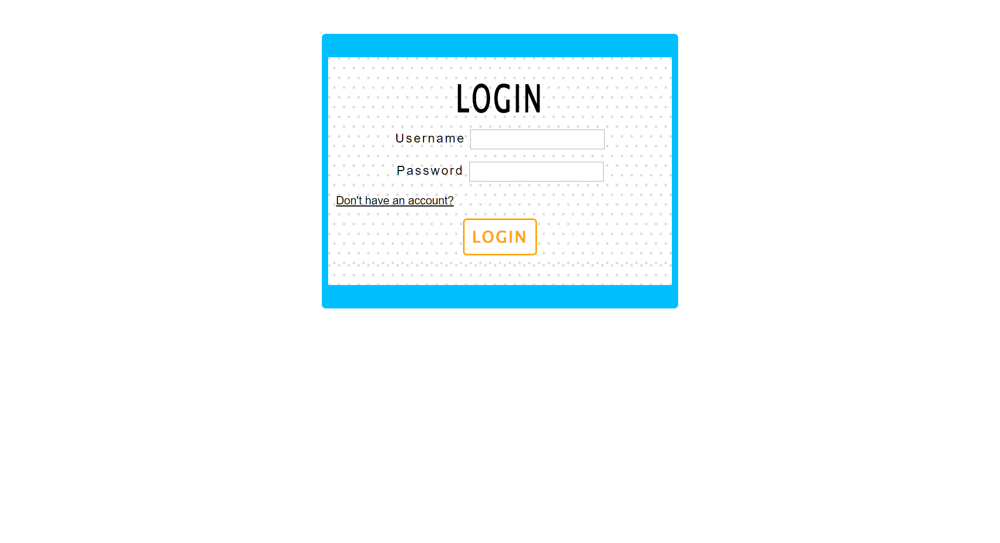
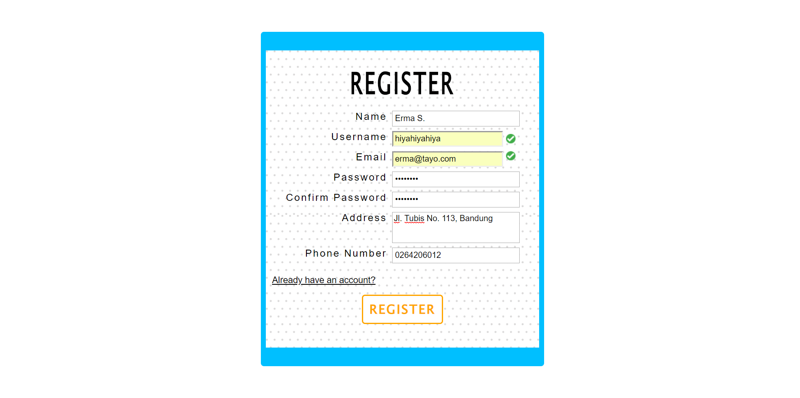
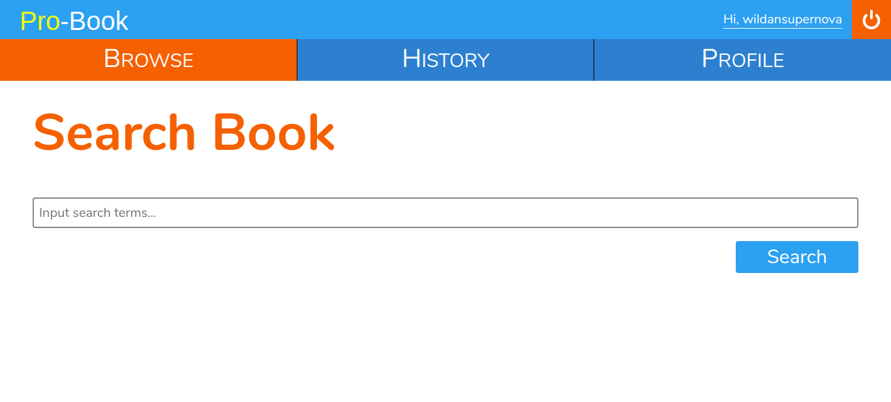
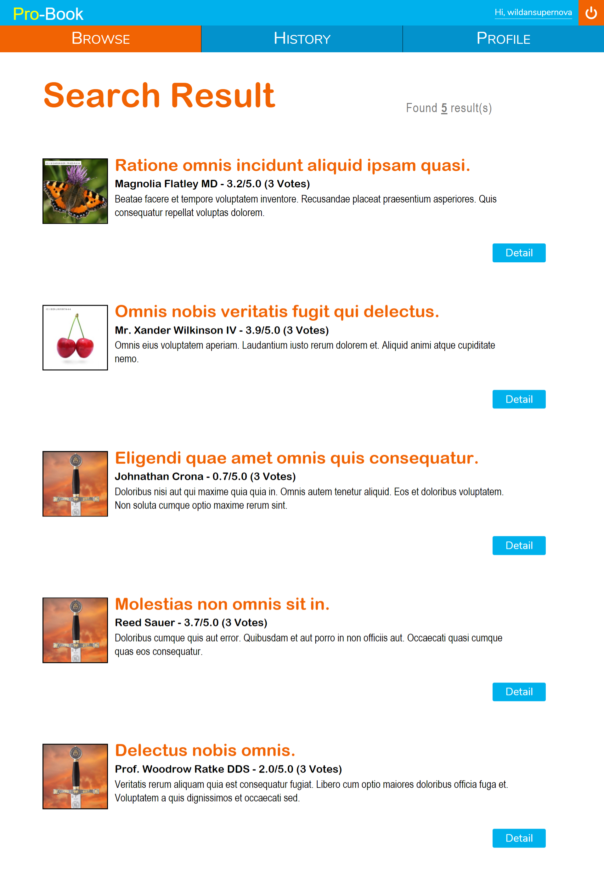
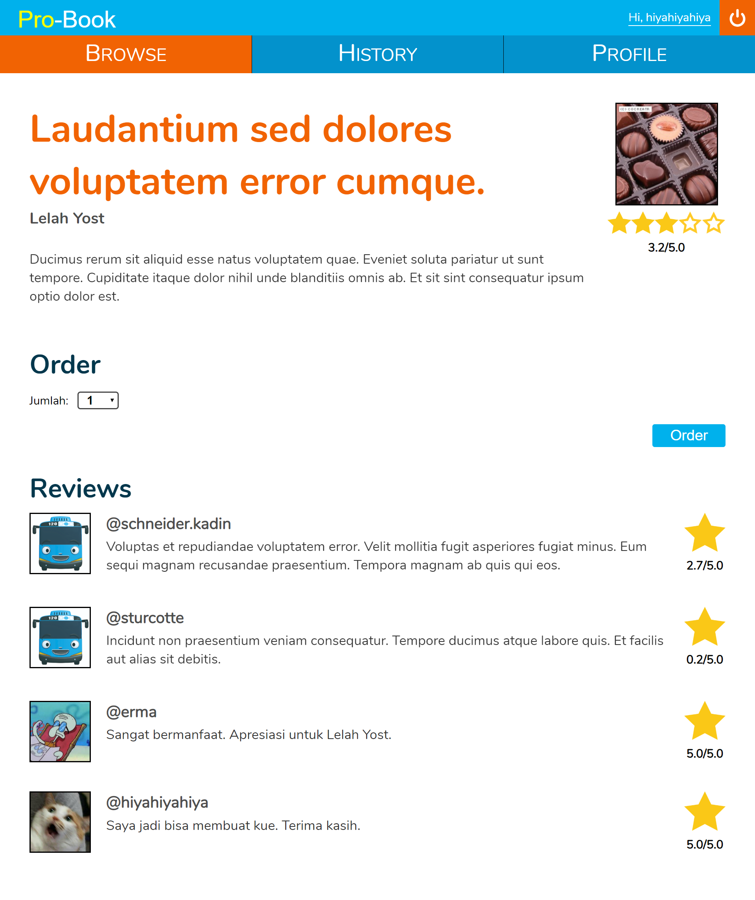
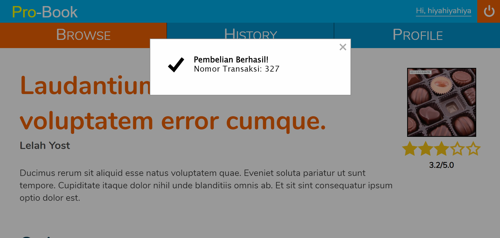
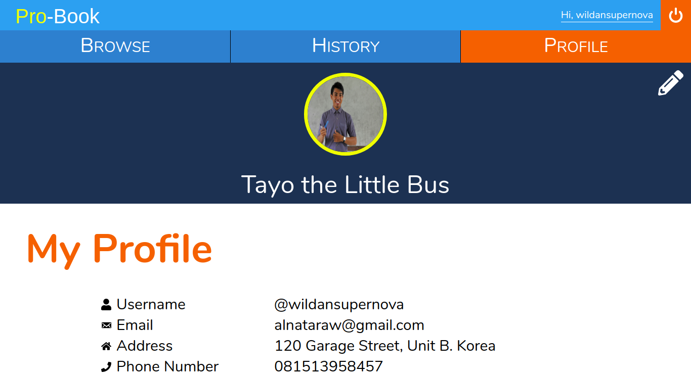
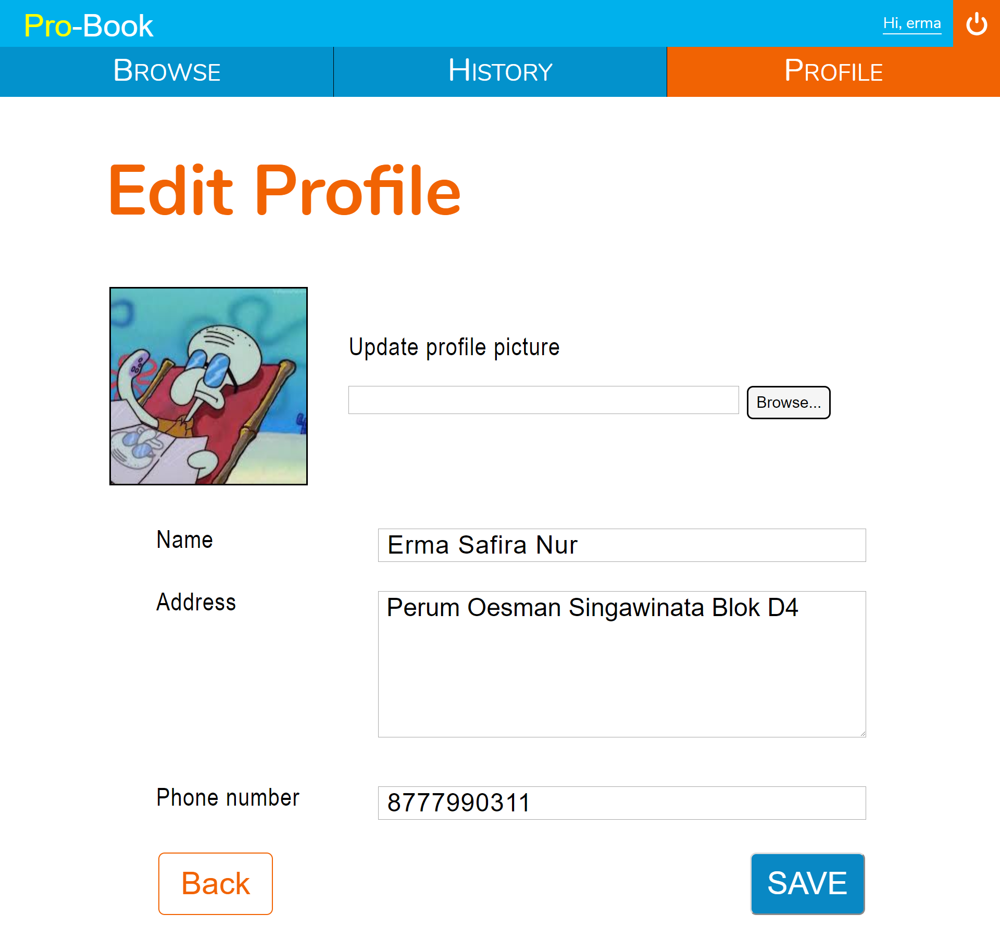
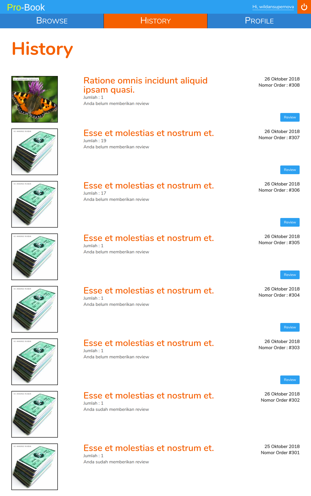
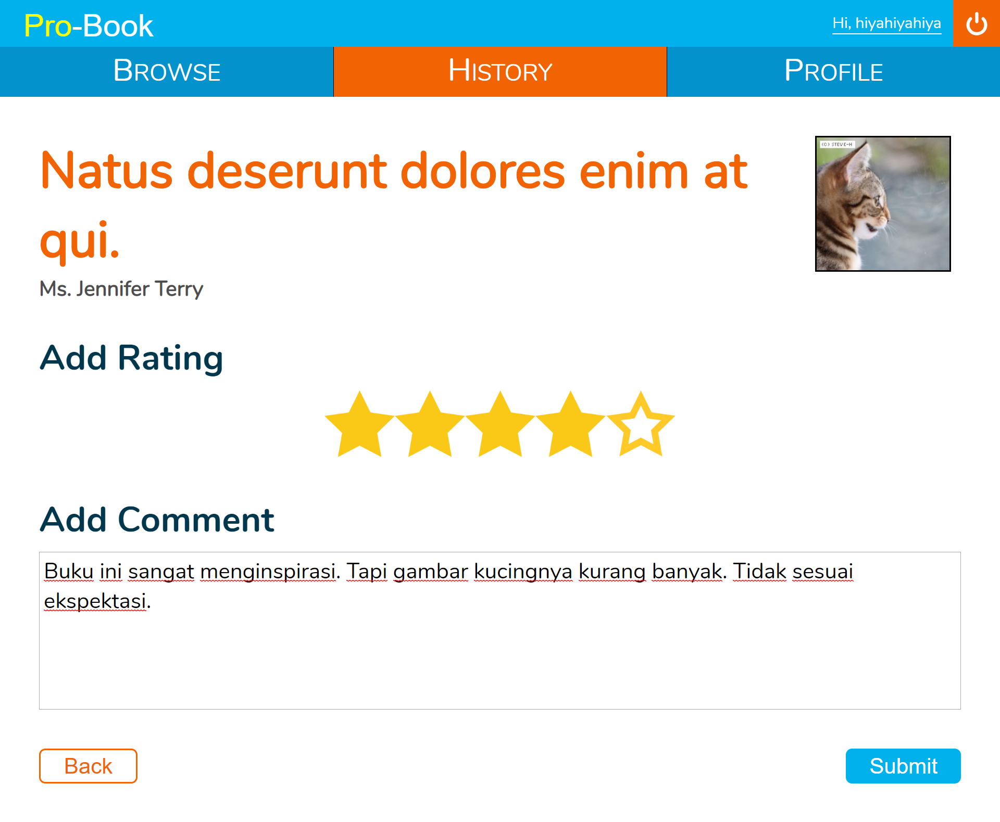

# Tugas 1 IF3110 Pengembangan Aplikasi Berbasis Web
<h1 align="center">
   
  Pro-Book Website
   
   
</h1>

## Deskripsi Singkat

**Pro-Book** merupakan *toko buku online* **berbasis web** yang memungkinkan seorang pengguna untuk membeli dan memberi komentar pada buku. Untuk menggunakan aplikasi ini, pengguna harus melakukan registrasi akun, kemudian login terlebih dahulu.

## Tools
1. Backend: **PHP** tanpa framework apapun. 
2. Database: **MySQL**.
3. Frontend: **Javascript, HTML dan CSS.** tanpa menggunakan library atau framework apapun.

## Dokumentasi
How to Run
1. Install PHP 7.2
2. Install MySQL
3. Import SQL sesuai dengan "dataseed.sql" pada folder data
4. Ubah nama file "config.example.php" menjadi "config.php". Lalu sesuaikan kongfigurasikan file tersebut sesuai settingan database anda
5. masuk ke folder web dan jalankan command "php -S localhost:8000"
6. Buka localhost:8000 pada browser

Dokumentasi Link
- Login Page : "/" 
- Browse Page : "/browse"
- History Page : "/history"
- Profile Page : "/profile"
- Edit Profile : "/edit_profile"
- Search Page : "/search_result?search_text=<TEXT>"
- Detail Page : "/book_detail?id=<ID>"
- Review Page : "/review?id=<ID>"

## Tampilan

### Login

Pengguna dapat melakukan login sebagai user. Identitas pengguna yang sudah login akan disimpan sebagai cookie dalam browser. Data yang disimpan pada cookie berupa `access token` yang dibangkitkan secara random dan memiliki `expiry time`. Jika `access token` ini tidak ada atau tidak valid, maka pengguna dianggap belum login.

### Register

Pengguna dapat mendaftarkan diri sebagai user agar dapat menggunakan aplikasi ini. Pengguna tidak dapat mendaftarkan diri menggunakan email dan/atau username yang sudah pernah digunakan sebelumnya. Jika email dan username valid akan ditandai dengan lambang centang seperti pada gambar. Setelah mendaftarkan diri, pengguna akan secara otomatis login dengan user yang baru didaftarkannya.

### Search-Books

Search-Books merupakan halaman utama yang ditampilkan ketika user telah login. Pada halaman Search-Books, terdapat sebuah input field dapat diisi pengguna untuk melakukan pencarian buku berdasarkan judul.
Setelah pengguna menekan tombol search, pengguna akan dibawa ke halaman Search-Result.

### Search-Result

Pada Search-Result, ditampilkan daftar buku dan jumlah hasil pencarian. Pada tiap entri buku ditampilkan judul, penulis, gambar, potongan sinopsis, serta rating dari buku tersebut. Jika tombol detail ditekan, pengguna akan dibawa ke halaman Book-Detail dari buku yang bersangkutan.

### Book-Detail

Pada halaman ini, ditampilkan detail buku yang terdiri dari judul, penulis, gambar, rating, serta komentar dan rating dari user lain. Pada halaman ini juga disediakan dropdown untuk memasukkan jumlah buku yang ingin dipesan dan tombol order. Jika tombol order ditekan, proses pemesanan akan dilakukan.

Setelah proses pemesanan selesai dilakukan, akan muncul notifikasi pada browser pengguna.

### Profile

Pada halaman ini, ditampilkan nama lengkap, username, email, alamat, nomor telepon, dan foto profil. Pada bagian kanan atas terdapat tombol edit, jika pengguna menekan tombol tersebut, pengguna dibawa ke halaman Edit-Profile.

### Edit-Profile

Pada halaman ini, pengguna dapat mengubah nama yang ditampilkan, alamat, nomor telepon, dan foto profil.

Pada bagian bawah halaman, terdapat tombol Back dan Save. Jika tombol save ditekan, nama dan alamat pengguna akan diganti sesuai input field.

### History

Pada halaman ini, ditampilkan daftar buku yang sudah pernah dipesan oleh pengguna, diurutkan berdasarkan waktu pemesanan dengan pesanan paling baru merupakan entri paling atas.

### Review

Pada halaman ini, pengguna dapat memberikan review untuk buku yang dipesan berupa rating dan komentar. Review yang diberikan dari halaman ini akan muncul pada halaman Book-Detail dari buku yang di-review.

### Pembagian Tugas

**Tampilan**
1. Login-logout : 13516006
2. Register : 13516072
3. Profile  : 13516012
4. Edit profile : 13516006
5. Browse/ Search : 13516012
6. Search result : 13516006
7. Book detail : 13516072
8. History : 13516012
9. Review : 13516072
10. Header-menu: 13516012

**Fungsionalitas**
1. Login-logout : 13516006
2. Register : 13516072
3. Profile  : 13516012
4. Edit profile : 13516006
5. Browse/ Search : 13516012
6. Search result : 13516006
7. Book detail : 13516072
8. History : 13516012
9. Review : 13516072
10. Header-menu: 13516012

## Author
<h2 align="center">
  Ranindya Paramitha - 13516006
   
  Wildan Dicky Alnatara - 13516012
   
  Erma Safira Nurmasyita - 13516072
</h1>